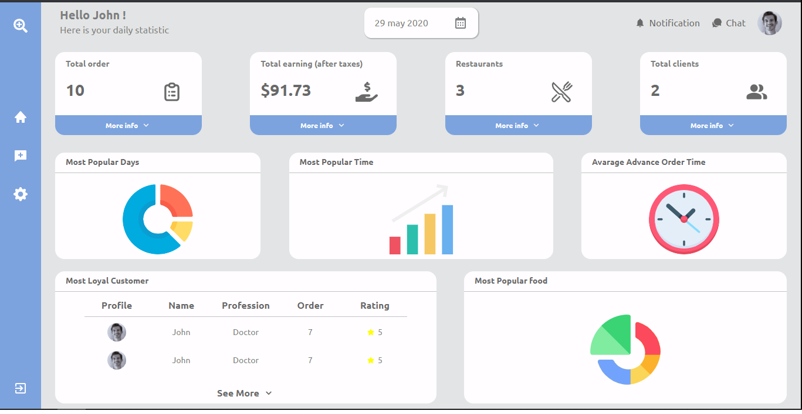

<h1 align="center">Teste Prático - Dashboard React</h1>

 

<blockquote align="center">“A chave para transformação é a continuidade. Continue a codar!!!”</blockquote>

 

 
 

## Sumário

- [Apresentação da Aplicação](#-apresentação-da-aplicação)
- [Sobre a Aplicação](#-sobre-a-aplicação)
- [Tecnologias utilizadas](#-tecnologias-utilizadas)
- [Ideias para Implementar](#-ideias-para-implementar)

 

## Apresentação da Aplicação

 

  

 

## Sobre a Aplicação

 

    Esse foi um projeto para fazer um teste prático. O objetivo era desenvolver em React uma imagem de uma UI que representasse um dashboard.

 

## Tecnologias Utilizadas

 

<code></code>
<code></code>

 

## Ideias para Implementar

 

- [ ] O projeto está estático sem nenhuma funcionalidade - adicionar funcionalidades.

 
 

 
 

<h3 align="center">
    
</h3>

